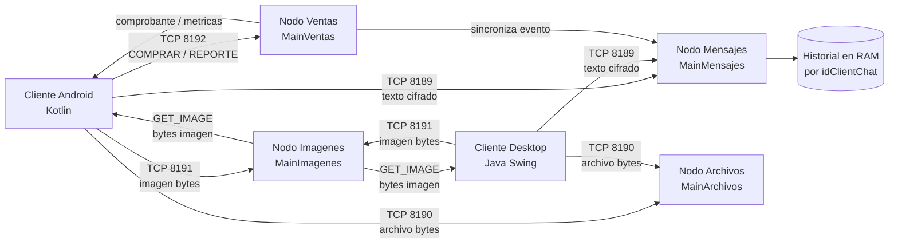
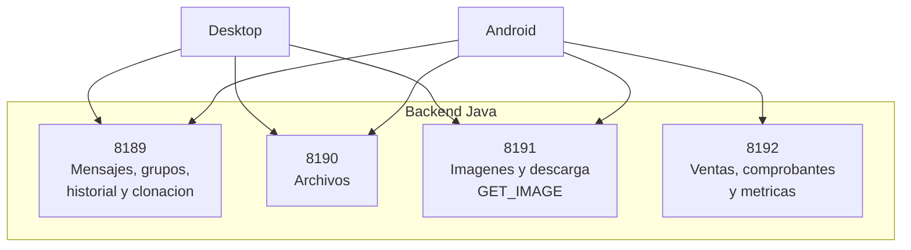
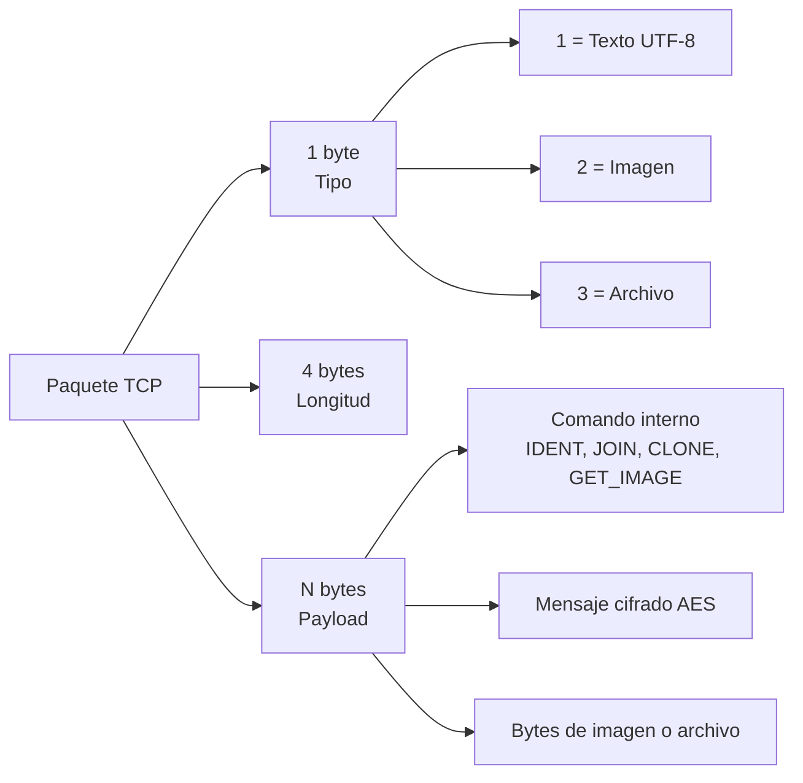
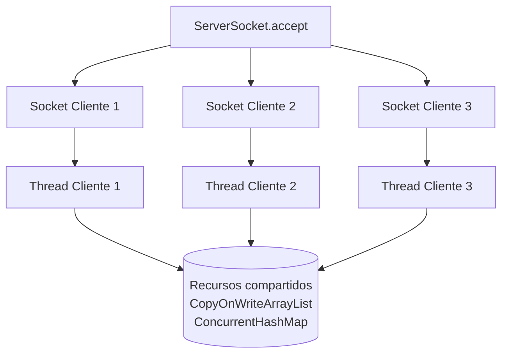

# Diagramas Dog Messenger

Este documento contiene diagramas listos para copiar a Mermaid Live Editor, Markdown con soporte Mermaid, Obsidian, GitHub o herramientas similares. Se pueden exportar como imagen e incluir en el informe y la presentacion.

## 1. Arquitectura General



## 2. Cluster de Nodos



## 3. Protocolo TCP



Ejemplo de trama:

```text
tipo      = 1
longitud  = 24
payload   = IDENT:0812
```


## 4. Hilos y Concurrencia



